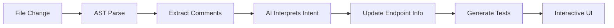

# Apirena: The Code-Aware API Development Environment

Apirena is an intelligent API testing and development tool that understands your code, not just your specs. It watches your entire codebase, automatically discovers endpoints, and uses AI to generate tests and catch issues before you deploy.

## Why Apirena?

**The Problem**: Current API tools require manual setup, drift from your code, and treat your APIs as static endpoints rather than living code.

**Our Solution**: Apirena watches your actual source files, understands your code through AST parsing, and maintains a real-time, intelligent view of your API surface. No more outdated Postman collections or manual endpoint updates.


## ✨ Key Features

### 🧠 **Smart Code Understanding**
- Automatically discovers ALL endpoints - not just documented ones
- Understands Express, FastAPI, Spring, Rails, and more
- No OpenAPI required (but fully supported when available)

### 📝 **Natural Documentation**
Write docs how you think - our AI understands intent, not syntax:
```javascript
// Get user by ID - returns 404 if not found
// Needs admin token or user's own ID
app.get('/users/:id', ...)

// ANY comment style works - we understand them all
```
No strict formats. No special annotations. Just write what makes sense.

### 🤖 **AI-Powered Testing**
- Generates test scenarios from your code patterns
- Learns from your API usage to suggest edge cases
- "This endpoint usually fails when X is null - test it?"

### ⏰ **Time-Travel Debugging**
- Records all API interactions with full request/response
- Replay any session against current code
- "Show me how this API behaved last Tuesday"

### 🔄 **Real-Time Code Sync**
- File watcher updates endpoints as you type
- Git-aware diffing shows API changes per commit
- Auto-detect environment variables from code

### 👥 **Built for Teams**
- Share replay sessions via URLs
- Collaborative debugging with multiplayer cursors
- "Click here to reproduce my bug"

## 🚀 Getting Started

```bash
# Download the latest release
curl -L https://github.com/apirena/apirena/releases/latest/download/apirena-{os} -o apirena
chmod +x apirena

# Run in your project directory
./apirena

# Apirena automatically discovers your API surface
```

That's it. No configuration needed.

## 📝 Documentation That Just Works

Apirena's AI understands natural language comments. Document however feels right:

```python
# Old way (strict OpenAPI annotations)
@swagger.doc({
    'tags': ['users'],
    'parameters': [{
        'in': 'path',
        'name': 'id',
        'required': true,
        'schema': {'type': 'integer'}
    }]
})

# Apirena way (just write naturally)
# Get user by ID
# Returns user object or 404
@app.route('/users/<id>')
```

```javascript
// This creates user accounts
// Requires: email, password
// Optional: name, avatar
// Returns: user object with JWT token
router.post('/signup', ...)

// The AI understands this perfectly!
```

Our LLM parses intent, not syntax. Write docs for humans, and Apirena handles the rest.

## 🛠 Tech Stack

- **Core Engine**: Rust with Tokio for performance and reliability
- **Code Parser**: Tree-sitter for multi-language AST parsing
- **UI Framework**: Svelte 5 with reactive runes
- **Desktop**: Tauri 2 for native performance
- **Storage**: Embedded DuckDB for analytics and history
- **AI**: Local LLM integration (Ollama) with OpenAI fallback

## 📋 How It Works

1. **Watch** - Apirena monitors your entire project directory
2. **Parse** - Tree-sitter extracts API patterns from your code
3. **Understand** - AI interprets natural language comments
4. **Enhance** - Suggests tests and improvements
5. **Learn** - Every request improves future recommendations



## 🎯 Core Use Cases

### For Individual Developers
- Document as you code with natural comments
- Instantly test changes without leaving your editor
- Auto-generate test data that makes sense
- Catch breaking changes before commits

### For Teams
- Everyone writes docs their way - AI normalizes understanding
- Share exact API states for debugging
- Maintain living documentation that's always current
- Onboard new developers with interactive API exploration

### For AI-Assisted Development
- Perfect companion for Cursor/Copilot workflows
- Validates AI-generated endpoints automatically
- Human-in-the-loop testing for generated code

## 🗺 Roadmap

**Phase 1: Foundation** (Shipping now)
- [x] Multi-language endpoint discovery
- [x] Real-time file watching
- [x] Natural language comment parsing
- [x] Basic API testing UI
- [ ] Local LLM integration

**Phase 2: Intelligence** (Q1 2025)
- [ ] Smart test generation
- [ ] Pattern learning from usage
- [ ] Time-travel debugging
- [ ] Advanced code understanding

**Phase 3: Collaboration** (Q2 2025)
- [ ] Team sharing features
- [ ] Cloud replay storage
- [ ] Multiplayer debugging
- [ ] API analytics dashboard

## 💻 Development

```bash
# Clone the repository
git clone https://github.com/apirena/apirena.git
cd apirena

# Install dependencies
cargo build --release
cd ui && npm install

# Run in development
cargo tauri dev
```

### Architecture

```
apirena/
├── src-tauri/          # Rust backend
│   ├── parser/         # Tree-sitter integration
│   ├── ai/             # LLM integration
│   ├── watcher/        # File system monitoring
│   └── storage/        # DuckDB embedded
├── src/                # Svelte 5 frontend
│   ├── lib/            # Shared components
│   ├── stores/         # Reactive state (runes)
│   └── routes/         # UI views
└── grammars/           # Tree-sitter language support
```

## 🤝 Contributing

We're building the future of API development tooling. Contributors welcome!

**Priority Areas:**
- Additional language parsers (currently: JS/TS, Python, Rust, Go)
- Framework-specific endpoint detection
- AI model fine-tuning for API patterns
- UI/UX improvements

See [CONTRIBUTING.md](CONTRIBUTING.md) for guidelines.

## 📊 Why Not Just Use...

**Postman/Insomnia?** They're request builders. We understand your code.

**OpenAPI/Swagger?** Great when you have it. We work without it. Plus, strict annotation formats are painful.

**Bruno/Hoppscotch?** Still manual. We're automatic.

**Your IDE?** We complement it with specialized API intelligence.

## 📄 License

MIT - see [LICENSE](LICENSE)

## 🌟 Philosophy

APIs are living code, not static specifications. Documentation should be natural, not ceremonial. Apirena embraces this reality by understanding human intent, staying connected to your source, and evolving with your application. 

Write comments for humans. Let AI handle the machines.

Stop managing collections. Start coding with confidence.

---

Built with ❤️ by developers who were tired of "sync your Postman collection" messages in Slack.

[Website](https://apirena.dev) | [Discord](https://discord.gg/apirena) | [Twitter](https://twitter.com/apirena)
